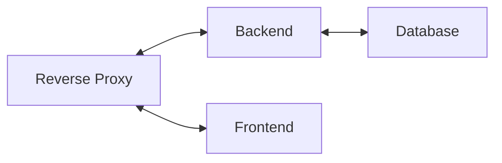

Wall-Color
---

This is a simple practice project for discovering the depth of Spring Boot and the needed DevOps tools for deploying a whole application (frontend, backend, database) in a manageable way.

Required tools
--------------
For project initialization, you need a POSIX-compatible terminal environment (e.g., Git Bash, GNOME Terminal, MSYS2, or Cygwin) so that standard Unix utilities such as `openssl`, `chmod`, `test`, `echo`, `printf`, `tail`, `mkdir`, and the `>>` redirection operator are available.

For running the project in a local multi-container environment you either need [Docker](https://docs.docker.com/engine/install/) & [Docker-Compose](https://docs.docker.com/compose/install/), or [Podman](https://podman.io/docs/installation) and [Podman-Compose](https://github.com/containers/podman-compose#installation).

For running the project in a [Kubernetes](https://kubernetes.io/) cluster, you obviously need some kubernetes implementation such as Kubernetes itself, [K3s](https://k3s.io/), [k3d](https://k3d.io/v5.6.3/), or [microk8s](https://canonical.com/microk8s) and you also need [helm](https://helm.sh/docs/).

To get started
--------------
Hit `./project-init.sh` in a terminal, then `./local-compose.sh up` and you get a local dev environment with hot reloading for both backend and frontend, plus TLS for the reverse proxy.
When you want to quit, either hit ctrl/command + c or (recommended) open a new terminal/tab and hit `./local-compose down`.
Check out other docs to see more details regarding [project initialization](./docs/project-initialization.md) and [local development](./docs/local-dev.md).
Regarding kubernetes manifests [click here](./docs/kubernetes-manifests.md).

Backend, frontend and database are directly accessible for debugging purposes:
- BE: 8080 port
- FE: 4200 port
- DB: 5432 port

There's also reverse proxy on port 2000 before BE/FE. It already supports http3,http2,http1.1 protocols and it uses TLS. (Most probably because of the self certification and localhost, your browser will use http2.)
More details in [reverse proxy docs](TODO)

General architecture
-------------------

