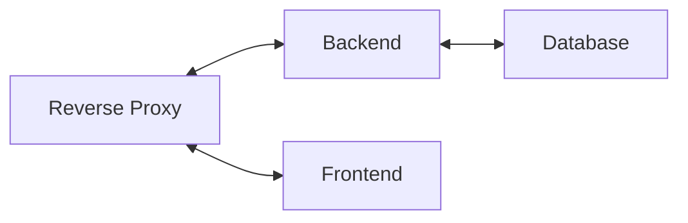

Wall-Color
---------

A practice project aimed at exploring Spring Boot in depth and the DevOps tooling required to deploy a complete application stack — frontend, backend, and database — in a manageable and reproducible way.

Required tools
--------------
### Project initialization
A POSIX-compatible terminal environment is required to initialize the project (e.g. Git Bash, GNOME Terminal, MSYS2, or Cygwin). The environment must provide standard Unix utilities such as `openssl`, `chmod`, `test`, `echo`, `printf`, `tail`, `mkdir`, and support for the `>>` redirection operator.

### Local development
To run the application locally in a multi-container environment, either of the following setups is required:

- [Docker](https://docs.docker.com/engine/install/) and [Docker Compose](https://docs.docker.com/compose/install/)
- [Podman](https://podman.io/docs/installation) and [Podman Compose](https://github.com/containers/podman-compose#installation)

### Kubernetes
To deploy the application to a [Kubernetes](https://kubernetes.io/) cluster, a Kubernetes distribution such as Kubernetes itself, [K3s](https://k3s.io/), [k3d](https://k3d.io/v5.6.3/), or [microk8s](https://canonical.com/microk8s) is required, along with [Helm](https://helm.sh/docs/).

Getting started
--------------
Run the following commands from a terminal from the root of the project:

```sh
./project-init.sh
./local-compose.sh up
```
This starts a local development environment with hot reloading enabled for both the backend and frontend, as well as TLS support for the reverse proxy.

To stop the environment, either press <kbd>Ctrl</kbd>/<kbd>Cmd</kbd> + <kbd>C</kbd>, or (recommended) open a new terminal or tab and  run:
```sh
./local-compose.sh down
```

For further details, see:
- [Project initialization](./docs/project-initialization.md)
- [Local development](./docs/local-dev.md)
- [Kubernetes manifests](./docs/kubernetes-manifests.md)

Direct access to services
-------------------------
For debugging and development purposes, the individual services are directly accessible:

- Backend: localhost:8080
- Frontend: localhost:4200
- Database: localhost:5432

A reverse proxy is also available on port **2000**, sitting in front of the backend and frontend. It supports **HTTP/1.1**, **HTTP/2**, and **HTTP/3**, and terminates **TLS**.
Due to the use of a self-signed certificate on `localhost`, most browsers will negotiate **HTTP/2** by default.

Additional details are available in the [reverse proxy documentation](./docs/reverse-proxy.md).

General architecture
-------------------


