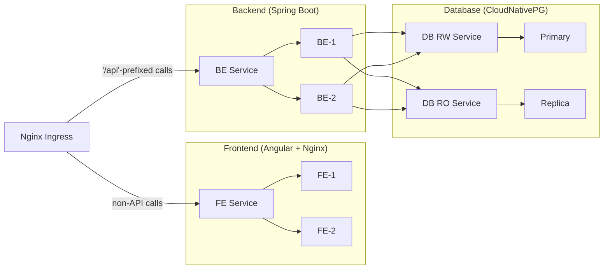

Kubernetes deployment
---------------------
As described in the [main documentation](../README.md), deploying the application requires **Kubernetes** and **Helm**. A minimal Helm chart is provided under the _helm-chart_ directory.

To install the chart, open a terminal at the project root and run:

```sh
helm install <release-name> ./helm-chart/ --values ./helm-chart/values.yaml
# example
helm install wall-color-release ./helm-chart/ --values ./helm-chart/values.yaml
```

The provided _values.yaml_ serves the same purpose as env-example.txt: it is only an example. Adjust the values as needed, or supply your own values file instead.
For production environments, consider enabling [encryption at rest](https://kubernetes.io/docs/tasks/administer-cluster/encrypt-data/) for Kubernetes Secrets.

To remove the deployment, use the uninstall command:

```sh
helm uninstall <release-name>
# example
helm uninstall wall-color-release
```

Kubernetes components
---------------------
If the general architecture is already familiar, the Kubernetes layout should not contain any surprises:



Database
--------
Each service runs with two replicas. For stateless components such as the frontend and backend, horizontal scaling is straightforward and does not introduce additional complexity.

Databases are fundamentally different. If a database were deployed using a standard [Deployment](https://kubernetes.io/docs/concepts/workloads/controllers/deployment/), each replica would receive its own [PersistentVolume](https://kubernetes.io/docs/concepts/storage/persistent-volumes/). These instances would not communicate with one another, leading to divergent state: query A could hit one instance, while query B hits another.

Using a [StatefulSet](https://kubernetes.io/docs/concepts/workloads/controllers/statefulset/) alone does not solve this problem. While it provides stable network identities and ordered startup, it does not address replication, failover, or consistency.
Managing these concerns manually is complex and error-prone. Kubernetes addresses this class of problems through the [Operator pattern](https://kubernetes.io/docs/concepts/extend-kubernetes/operator/).

CAP
---
In a distributed database system, three properties are typically desired:
- consistency between instances
- high availability
- tolerance to node failures

According to the [CAP theorem](https://en.wikipedia.org/wiki/CAP_theorem), only two of these guarantees can be fully achieved at the same time, although practical systems often implement trade-offs.

A database operator is responsible for managing these trade-offs on behalf of the user.

CloudNativePG
-------------
There are many existing PostgreSQL operators available. This project uses [CloudNativePG](https://cloudnative-pg.io/).

Similar to the local PostgreSQL container setup, an initial database structure is required. In this case, only the schema is needed from the [_seed_](../postgresdb/seed/) folder.

Initialization differs from the container-based approach. Instead of copying SQL files into the image, CloudNativePG references SQL statements via ConfigMaps or Secrets using [`postInitApplicationSQLRefs`](https://cloudnative-pg.io/documentation/1.17/api_reference/#postinitapplicationsqlrefs).

Because Helm is used, the schema file (_00\_schema.sql_) is included via the .Files.Get templating function.

To maintain a single source of truth, the same schema file is reused. However, Helm cannot access files outside the chart directory (_helm-chart_). To work around this limitation, a relative symbolic link is created within the chart directory, allowing the schema file to be included in _00\_schema.sql.yaml_


Summary of ports
----------------

| Service       | Port                  |
| ------------- | ----------------------|
| Frontend      | TCP: 4200             |
| Backend       | TCP: 8080             |
| Database      | TCP: 5432             |
| Ingress       | TCP/UDP: 443, TCP: 80 |


